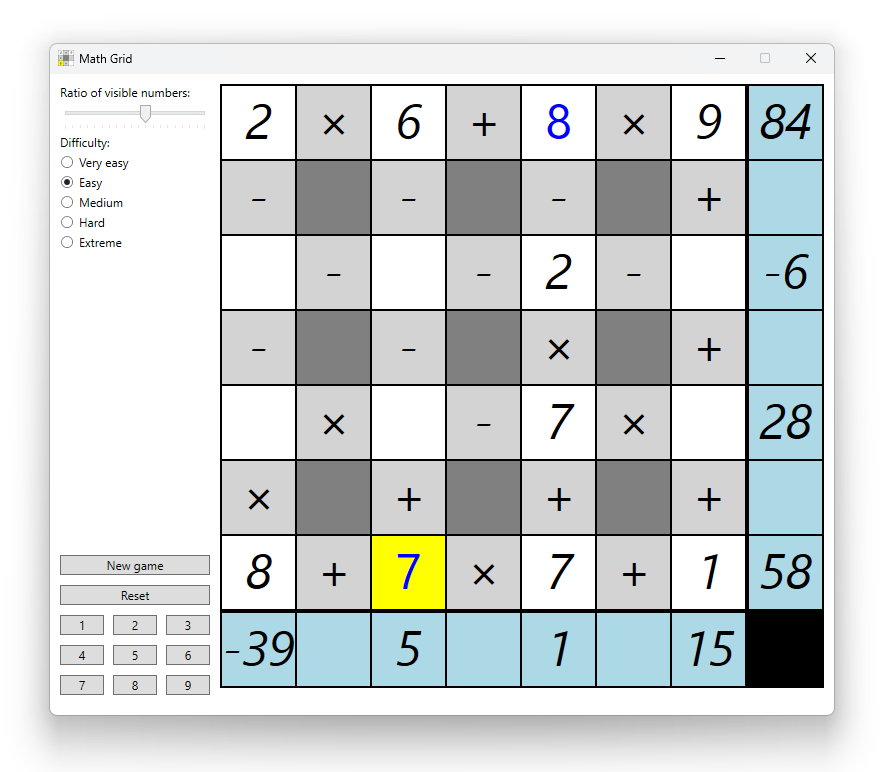

# MathGrid
A simple mathematical game created using WPF (.NET 8).

## How to play
The generated grid consists of cells with numbers (these can be empty), mathematical signs between the numbers and the sums of each row and column. Mathematical signs can be `+`, `-` or `×`, where `×` cannot have another `×` as a neighbour.

Your task is to fill all the empty cells in the grid with numbers to get the correct results in all the rows and columns. You can use the numeric keypad to enter numbers, the arrows or left-click to move, the `N` key to generate a new game, the `R` key to reset the game and the `F` key or right-click to fix the selected number (this makes your input unresetable). The level of difficulty (number of cells) and the ratio of visible numbers are adjustable. Good luck!

## Codebase
The app uses Dependency Injection.
### `GameLogic`
Services and other classes that are independent of the UI framework.
### `MathGrid`
The UI framework.
### `Tests`
Tests that cover some of the methods in the `GameLogic` project. They use `MSTest` and `FluentAssertions`.
